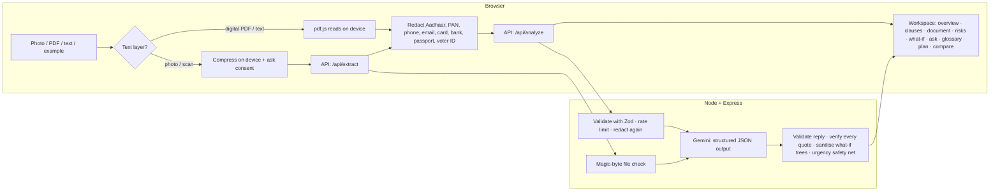

# Clause Anatomy ⚖️

**Understand any everyday legal paper — clause by clause, in your own language — and prove to yourself that you understood it.**

Built for **Google PromptWars · Challenge vertical: _AI for Legal Assistance & Access_**, powered by **Google Gemini**.

> Clause Anatomy explains legal papers in simple words. It is **not a lawyer** and does **not** give legal advice. AI can make mistakes: always check the original paper and talk to a lawyer or free legal aid (India: **NALSA 15100**) before important decisions.

---

## 1. The problem

Legal papers are written for lawyers. A tenant, a new employee or someone holding a legal notice sees _"Notwithstanding anything contained in Clause 9, the Lessee shall not sublet… failing which the security deposit shall stand forfeited"_ and cannot tell **who must do what, unless what, or what happens if they don't**. Summaries hide those details; chatbots answer only the questions people already know to ask. People who most need help — limited literacy, not fluent in English, only a phone — are the least served.

## 2. Our approach: explain the _structure_, then check understanding

Most "legal AI" tools summarise. Clause Anatomy does four things differently:

| #   | Idea                                | What the reader sees                                                                                                                                                                                                                                                                               |
| --- | ----------------------------------- | -------------------------------------------------------------------------------------------------------------------------------------------------------------------------------------------------------------------------------------------------------------------------------------------------- |
| 1   | **Clause anatomy**                  | Every important clause is broken into colour + icon + word coded parts: **You must / You must not / You may / Unless / If broken / Time limit**, plus the verbatim quote it came from.                                                                                                             |
| 2   | **Teach-back ("Did you get it?")**  | Borrowed from health literacy: a real-life Yes/No question after each important point. A wrong or "Not sure" answer re-explains it more simply and adds it to the questions for a lawyer.                                                                                                          |
| 3   | **Deterministic what-if simulator** | "What if I want to leave early?" becomes a small Yes/No decision tree. The AI proposes the tree; **plain, tested code** validates it (no cycles, no dangling links, only verified points) and walks it — same answers, same outcome, every time.                                                   |
| 4   | **Grounding you can see**           | Every point carries an exact quote. The server **verifies each quote against the document**; unverified points are clearly marked and never quizzed. Term meanings are badged _From your paper_ or _General information — check with a lawyer_. "Show in original" highlights the source sentence. |

And around the core:

- **Who are you in this paper?** Pick _Tenant_ or _Landlord_: every rule is relabelled ("You must…"), risks are flagged from _your_ side, and a personal duties checklist is built — with no extra AI call.
- **Next steps**: personal checklist, important dates (**add to calendar** as `.ics`), and a **lawyer-ready brief** (copy / share on WhatsApp / print) that includes what the reader did not understand and questions the paper could not answer.
- **Ask about your paper**: typed or **spoken** questions; answers are labelled _from your paper_, _general information_ or _needs a lawyer_, with verified quotes.
- **Notices & urgent papers**: legal notices get a _Who sent it / What they claim / What they want / By when / If ignored_ summary. A deterministic safety net raises urgency for warrants, summons or eviction (English, Hindi, Telugu) and shows **free legal aid (15100)** with tap-to-call.
- **Honest scope**: papers that are not legal documents are recognised and explained as such; court papers are explained but pointed to a lawyer.

### A complete product, not a demo page

- **Home page** (`#/`): what Clause Anatomy is, the problem it solves, features, how it works, privacy and trust, and a clear call to action. The interface language (English, हिन्दी, తెలుగు) and light/dark theme are in the header; first-time visitors automatically get their browser's language.
- **Policy pages**: Privacy policy, Terms of use, Disclaimer and Accessibility statement, in all three interface languages, written to describe exactly what the code does.
- **Site footer** with product, legal and help links (NALSA 15100, emergency 112) and the copyright/licence notice. Every page has a shareable address; refresh and Back/Forward work.
- **Brand**: an original logo, "the pulled-out clause" (a clause drawn out from between section brackets, like a part in an exploded anatomy diagram), used for the favicon, app icons and web app manifest.

### The legal intelligence workspace

The interface is a **neo-brutalist, document-first dashboard** (hard borders, flat accent colours, Swiss-editorial numbered sections, a serif "paper" for the document itself), not a one-page result. A sidebar (a menu drawer and a bottom bar on phones) leads to numbered sections:

| #   | Section         | What it does                                                                                                                                                   |
| --- | --------------- | -------------------------------------------------------------------------------------------------------------------------------------------------------------- |
| 00  | **Workspace**   | Add a paper (photo, file with drag-and-drop, paste, examples), reopen papers from this session, choose the explanation language.                               |
| 01  | **Overview**    | KPI strip (clauses, need attention, quotes verified, understood, next date countdown), role picker, who-the-paper-favours bar, top risks, timeline, parties.   |
| 02  | **Clauses**     | Searchable, filterable clause index (attention / flagged / not understood), clause anatomy, teach-back, **personal notes**, **flag for a lawyer**, J/K keys.   |
| 03  | **Document**    | The redacted paper with every explained sentence highlighted and numbered, and **margin notes** linked both ways with the clauses.                             |
| 04  | **Risk radar**  | Every clause placed on an importance × "which side it favours" matrix, plus _what can go wrong_ collected from all clauses.                                    |
| 05  | **What if?**    | The deterministic Yes/No simulator with the reader's answer trail.                                                                                             |
| 06  | **Ask**         | A conversation about the paper (typed or spoken), with verified quotes; any clause can start a question.                                                       |
| 07  | **Glossary**    | Every legal word in the paper, searchable, with its source badge and links to the clauses that use it.                                                         |
| 08  | **Action plan** | Duties checklist, dates (.ics), free legal aid and the lawyer brief — now including flagged clauses and the reader's own notes (copy, share, download, print). |
| 09  | **Compare**     | Two papers side by side: key facts (money, dates, verified quotes), similar clauses matched locally, and clauses found in only one paper.                      |

A **command palette** (<kbd>Ctrl</kbd>/<kbd>⌘</kbd> + <kbd>K</kbd> or <kbd>/</kbd>) jumps to any section, clause or legal word. The **sidebar collapses** to an icon rail on large screens (remembered on the device) and becomes a menu drawer on phones and tablets. One **Settings** dialog holds the interface language, explanation language, reading level, **light / dark / auto theme** and **text size** (up to 125 %). All dropdowns are custom, keyboard-accessible comboboxes styled to match, and scrollbars follow the design.

## 3. Designed for every reader

- **Language first**: the interface follows the browser's language on the first visit and can be switched from any page, with each language shown in its own script. The **whole interface** is available in **English, हिन्दी and తెలుగు**; explanations are available in **10 Indian languages** (English, Hindi, Telugu, Tamil, Kannada, Malayalam, Marathi, Bengali, Gujarati, Punjabi).
- **Low-literacy friendly**: one clause at a time, short sentences, a _Simple / Detailed_ switch, icons **and** words (never colour alone), tap-to-answer checks, and **read-aloud** on every explanation (browser speech, no audio sent to our server).
- **Photo first**: most people have a paper, not a PDF. Take a photo, upload a PDF/photo/text file, paste text, or try a built-in example.
- **Responsive and adaptive**: mobile-first layout tested at phone (Pixel 7), tablet (820×1180) and desktop (1440×900); safe-area insets, 48 px touch targets, light/dark/auto themes and adjustable text size, reduced-motion support, print styles for the brief.
- **Accessible**: semantic landmarks, skip link, native radio groups for every choice, a WAI-ARIA combobox command palette and focus-trapped dialogs, focusable scroll regions, focus management between sections, `lang` attributes on every piece of mixed-language content, live regions for progress. Verified with **axe-core** in unit tests and in real Chrome (WCAG 2.2 AA, including contrast, light and dark).

## 4. How it works



1. **Read** — text files and digital PDFs are read _on the device_ (pdf.js is lazy-loaded only when a PDF is chosen). Photos are resized and compressed on the device; before a photo or scan is sent for transcription the reader is told, in plain words, that pictures cannot be redacted first, and must agree.
2. **Protect** — personal identifiers are redacted in the browser **and again on the server** (defence in depth). Nothing is stored; responses are `Cache-Control: no-store`.
3. **Explain** — Gemini returns JSON constrained by a schema generated from the same Zod schema the server validates against (one source of truth). The document is fenced with a random per-request boundary and the prompt treats it as untrusted data (prompt-injection defence).
4. **Verify** — the server checks every quote against the document (normalised exact match → ordered ellipsis segments → ≥ 90 % word-window match), removes teach-back questions from unverified points, downgrades ungrounded term sources, renumbers ids, drops impossible dates and rejects invalid what-if trees.
5. **Change language without re-reading** — switching the explanation language never analyses the paper again. Only the plain-language texts (never the paper, quotes or legal terms) go to `/api/translate`, are translated in parallel chunks, and are mapped back by id, so every language shows exactly the same clauses, notes and flags. Each language is cached in the tab, so switching back is instant.
6. **Personalise** — perspective, reading level, risk radar, glossary, comparisons, checklists, calendar files and the lawyer brief are all computed in the browser from the verified result, with no extra AI calls.

### Architecture

```
shared/          Pure TypeScript used by browser AND server (~98 % line coverage)
  schema.ts        Zod schemas: AI output, API contracts (single source of truth)
  redact.ts        Indian PII redaction (ASCII, Devanagari and Telugu digits; Luhn for cards)
  verifyQuote.ts   Grounding check with offsets for highlighting
  scenario.ts      What-if tree validation and deterministic walker
  urgency.ts       Multilingual urgency safety net
server/          Express 5 API (dependency-injected, runs locally, on Node or serverless)
  ai/              Gemini client (timeouts, retries, safe error mapping), prompts, schema adapter
  services/        analyze / answer / extract + post-processing of model output
  middleware/      Helmet CSP, rate limiting, body validation, error handling
api/index.ts     Serverless entry (e.g. Vercel)
src/             React 19 UI
  app/             Workspace reducer (library, sections, notes, flags), reading-flow state machine, history
  features/        site (home page, legal pages, header/footer) · shell (sidebar, top bar, bottom bar,
                   command palette, settings) · home · working ·
                   overview · clauses · document · risks · whatif · ask · glossary · plan · compare
  lib/             Pure helpers: perspective, insights (risk matrix, glossary, annotations), compare, brief, .ics
  i18n/            Typed dictionaries (missing translation = build error)
  samples/         Pre-computed, schema-validated examples (work without an API key)
e2e/             Playwright tests in real Chrome at phone, tablet and desktop sizes
```

## 5. Evaluation focus areas

| Area                            | What we did                                                                                                                                                                                                                                                                                                                                                                                                                                                                                                                                                   |
| ------------------------------- | ------------------------------------------------------------------------------------------------------------------------------------------------------------------------------------------------------------------------------------------------------------------------------------------------------------------------------------------------------------------------------------------------------------------------------------------------------------------------------------------------------------------------------------------------------------- |
| **Code quality**                | Strict TypeScript (`noUncheckedIndexedAccess`), ESLint (typescript-eslint strict, react-hooks, jsx-a11y strict), Prettier, pure functions for all logic, dependency injection for the AI client, reducers for UI state, one schema source of truth, typed i18n.                                                                                                                                                                                                                                                                                               |
| **Security**                    | API key only on the server; strict CSP and Helmet headers; `no-store` caching; per-IP rate limiting; strict Zod validation (unknown fields rejected, size limits per route); magic-byte file validation; PII redaction on client and server; prompt-injection fencing; model output validated and clipped; errors never leak internals; logs never contain documents; secret scan and `npm audit` in CI. See [SECURITY.md](SECURITY.md).                                                                                                                      |
| **Efficiency**                  | Code-split UI (each workspace section, dialogs, legal pages, Hindi/Telugu interface text, examples, pdf.js and schema validation load on demand; everything the first screen needs is one JS and one CSS file); entry bundle budget enforced in CI; on-device text extraction and image compression; in-memory cache of analyses (SHA-256 key) so the same paper never costs a second AI call; perspective, checklists, briefs and what-if walks computed locally; low thinking level and single structured call per analysis; changing language translates only the explanation texts (analyse once) and caches every language; automatic fallback model when the main one is overloaded; gzip; immutable asset caching. |
| **Testing**                     | 200+ Vitest unit/integration tests (shared logic, workspace reducer, insights and compare, server with a fake AI, UI journeys through every section with axe) with coverage thresholds; Playwright end-to-end tests in real Chrome on mobile, tablet and desktop (journeys, keyboard-only, dark mode, Telugu, 320 px reflow at the largest text size in English, Hindi and Telugu, real PDF upload, photo consent, production security headers); examples validated by the same checks as live AI output.                                                                                                                          |
| **Accessibility**               | See section 3 — WCAG 2.2 AA verified with axe in jsdom and in Chrome (light and dark).                                                                                                                                                                                                                                                                                                                                                                                                                                                                        |
| **Problem statement alignment** | Understand (anatomy, glossary, teach-back, reading level, languages), compare (two papers side by side, risk radar, perspective lens), navigate (dashboard sections, command palette, annotated document, linked clauses, what-if), next steps (checklist, dates, lawyer brief, legal aid) — with visible grounding and a clear "not a lawyer" boundary.                                                                                                                                                                                                      |

## 6. Run it locally

Requirements: **Node.js 20.19+** (22 LTS recommended) and a free **Gemini API key** from [Google AI Studio](https://aistudio.google.com/apikey). The built-in examples work without a key.

```bash
npm install
cp .env.example .env        # then put your key in GEMINI_API_KEY
npm run dev                 # http://localhost:5173 (UI + API on one origin)
```

Production build:

```bash
npm run build
npm start                   # http://localhost:8787
```

### Environment variables

| Variable                | Required    | Default            | Purpose                                                                |
| ----------------------- | ----------- | ------------------ | ---------------------------------------------------------------------- |
| `GEMINI_API_KEY`        | for live AI | —                  | Gemini API key (server only, never sent to the browser)                |
| `GEMINI_MODEL`          | no          | `gemini-3.6-flash` | Any stable Gemini model with JSON output and image understanding       |
| `GEMINI_FALLBACK_MODEL` | no          | `gemini-2.5-flash` | Used automatically when the main model is overloaded (`none` disables) |
| `PORT`                  | no          | `8787`             | Port for `npm start`                                                   |
| `RATE_LIMIT_MAX`        | no          | `30`               | AI requests per client IP per 10 minutes                               |
| `AI_TIMEOUT_MS`         | no          | `120000`           | Hard timeout for each AI call                                          |

### Quality commands

```bash
npm run verify        # typecheck + lint + secret scan + unit tests with coverage + build + bundle budget
npm run test:e2e      # Playwright end-to-end tests (uses installed Chrome; set PLAYWRIGHT_CHANNEL=chromium to use Playwright's)
npm run audit:deps    # production dependency audit
```

### Deploying

The app is a static front-end plus one API. On **Vercel**, `vercel.json` builds the UI and serves `/api/*` from `api/index.ts`; set `GEMINI_API_KEY` in the project's environment variables. On any Node host (Render, Railway, Cloud Run…), run `npm run build && npm start`.

## 7. Assumptions

- Primary users are in **India**: Indian identifiers are redacted, Indian languages are supported, and legal aid contacts are Indian (NALSA helpline **15100**, emergency **112**).
- Target documents are **everyday legal papers** people receive: rent/lease agreements, job offers, loan and insurance papers, app terms and privacy policies, legal and demand notices. Court papers are explained but routed to a lawyer.
- Documents are up to about **60,000 characters** (≈ 25 pages); longer papers should be analysed in parts.
- Readers may have **limited literacy** and use **low-end phones on slow networks**; the design favours short text, icons with words, voice and small downloads.
- The built-in examples are **fictional**; any resemblance to real people is coincidental.

## 8. Limitations

- **Not legal advice.** Explanations can be wrong or incomplete even when quotes are verified; law also changes and varies by state.
- Redaction is **pattern-based**: it hides structured numbers but **not names or addresses**. Photos and scans are read by the AI before redaction (the reader is asked for consent first).
- Quote verification proves a quote **exists** in the paper, not that the explanation of it is correct.
- "General information" about Acts and sections comes from the model's general knowledge and is labelled accordingly.
- Read-aloud and voice questions depend on the voices and speech recognition available in the reader's browser.
- The session library (up to 6 papers), notes and flags stay inside the open browser tab (kept across a refresh in `sessionStorage`) and are cleared when the tab is closed — by design, nothing reaches a server.
- Clause matching in _Compare_ works best for papers of the same kind explained in the same language.
- Rate limiting is in-memory per server instance; a multi-instance deployment should use a shared store.
- The Gemini free tier has a small daily quota; once it is used up, live analysis and translation pause until the next day (the built-in examples keep working). A deployment for real users should enable billing.
- Interface translations (Hindi, Telugu) were written for this project and should be reviewed by native speakers before wide release.

## 9. Responsible AI

The model never tells a reader what to do; it describes what the paper says, options and consequences. Every claim is tied to visible evidence, uncertainty is shown rather than hidden, urgent situations surface free legal aid, and the app states on every screen that it is not a lawyer.

## License

[MIT](LICENSE)
